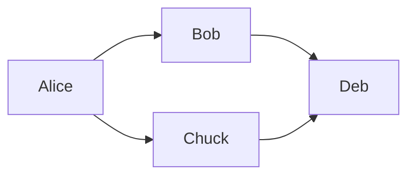

# Drawio Site

This is a template repository for web sites generated from [Drawio](https://www.drawio.com/) diagrams with [GitHub Actions](https://docs.github.com/en/actions) and [Nasdanika CLI Drawio Command](https://docs.nasdanika.org/nsd-cli/nsd/drawio/index.html).

[TOC levels=6]

## Demos

Below is a list of sites created from this template:

* [Bob the builder](https://nasdanika-demos.github.io/bob-the-builder/), this [video](https://www.youtube.com/watch?v=OtifPFetg9o) shows how this demo was created.
* [Internet Banking System](https://nasdanika-demos.github.io/internet-banking-system/index.html) - a sample C4 Model documented using this template/approach.
* [Declarative Command Pipelines](https://nasdanika-demos.github.io/declarative-command-pipelines/) - illustrations for a Medium story. This demo shows how to create a site from a diagram with multiple top-level pages.
* More demos on [Nasdanika Demos](https://github.com/orgs/Nasdanika-Demos/repositories)

## Steps

* On the [repository page](https://github.com/Nasdanika-Templates/drawio-site) click "Use this template" button in the top right.
* Once you create a new repository, go to the Settings > Pages and select "GitHub Actions" as source.
* Click on the Acitons tab. You should see a failed deployment. Manually trigger ``Generate HTML Site from a Drawio diagram with Nasdanika CLI`` action. Once it is successful, open the pages site.
* Customize the diagram, root action, and page template to your needs as explained below.

The deployment action can be triggered manually from the actions page. 
It can be useful if your site references external resources.

For example:

* The diagram file may link to pages in external diagrams (federated diagrams)
* The diagram file may reference external documentation resources

## Deployment process

* [Nasdanika CLI](https://docs.nasdanika.org/nsd-cli/index.html) is downloaded and extracted
* [drawio](https://docs.nasdanika.org/nsd-cli/nsd/drawio/index.html) <diagram file> [html-app](https://docs.nasdanika.org/nsd-cli/nsd/drawio/html-app/index.html) ... [site](https://docs.nasdanika.org/nsd-cli/nsd/drawio/html-app/site/index.html) ... command pipeline is executed to generate a Web site
* The generated site is deployed to [GitHub Pages](https://pages.github.com/). 

## Diagram file

You may rename ``diagram.drawio`` to something more meaningful, e.g.``my-system.drawio``. 
Or you may use a pre-existing drawio diagram and delete ``diagram.drawio``. 
You can also use an external diagram and reference it by URL.
If you do rename/replace the diagram, open ``.github/workflows/site.yml`` and update line 42 with a new diagram file name.

You can edit the diagram directly on GitHub using [Draw.io online editor](https://app.diagrams.net/)

## Page template

In the page template file you can:

* Modify the [theme](https://javadoc.io/doc/org.nasdanika.html/bootstrap/latest/org.nasdanika.html.bootstrap/org/nasdanika/html/bootstrap/Theme.html) on line 3 - choose one of 20+ [Bootswatch themes](https://bootswatch.com/4/) or the default theme. Please note that generated sites look good with light themes, and not so good (in my personal opinion) with dark themes.
* Highly recommended: remove out-of-the-box Google analytics script at lines 23-33 - replace it with your own or remove the header section (lines 22-33) altogether. 
* Remove line 36 or set ``fluid`` to ``false``.
* Modify [navigation panel style](https://html-app.models.nasdanika.org/references/eClassifiers/NavigationPanelStyle/index.html) at line 38

See [Bootstrap Page Load Specification](https://bootstrap.models.nasdanika.org/references/eClassifiers/Page/load-specification.html) for supported confiuration keys.

## Root action

The root action defines:

* The header (root action[^action_types]). You may modify the icon and the title. 
* Root navigation actions - lines 6 - 20. Glossary and search are functional, but not perfect - they need TLC, which I don't have capacity for at the moment. You may use them AS-IS, remove/replace, or improve and create a pull request. Their advantage is that they are standalone - no external dependencies. For public web sites you may consider something like [Algolia](https://www.algolia.com) - they have a [free tier](https://www.algolia.com/pricing/) and a [Vue.js](https://vuejs.org/) search component, [InstantSearch](https://www.algolia.com/doc/guides/building-search-ui/what-is-instantsearch/vue/)
* Footer (root navigation) at lines 21+. Out of the box is links to the template repository site - update or remove.

See [Action Load Specification](https://html-app.models.nasdanika.org/references/eClassifiers/Action/load-specification.html) for supported configuration keys. 

[^action_types]: See [Action types](https://html-app.models.nasdanika.org/index.html#action-types)

## Diagram elements

You can add documentation to diagram elements, ``title`` and ``icon`` property, customize element ID, and link elements to pages or other elements, including pages and elements in other diagram files.

You can also define action/label prototypes for diagram elements with ``prototype`` and ``proto-ref`` properties.

Site pages are generated only for elements with documentation, prototypes, or both.

Important: Pages are not generated for diagram elements without labels or ``title`` property! It may lead to broken links.

### Documentation

You can add inline documentation in ``documentation`` property as it is done for [Alice](https://nasdanika-templates.github.io/drawio-site/alice/index.html).

Documentation is by default treated as Markdown. 
Use ``doc-format`` property to specify documentation format.
Out of the box there are 3 formats supported:

* ``markdown``
* ``html``
* ``text``

You can add support for more formats, e.g. [Asciidoc](https://docs.asciidoctor.org/asciidoc/latest/) using [AsciidoctorJ](https://github.com/asciidoctor/asciidoctorj)
or create a template engine documentation format - [Apache FreeMarker](https://freemarker.apache.org/) or [Mustache](https://github.com/spullara/mustache.java).
See "Adding support for documentation format" below. 

You may reference an external documentation resources with ``doc-ref`` property - this how it is done for the diagram root (click on the diagram canvas and then on "Edit Data" button in the right panel). 
Documentation reference is a URL resolved relative to the diagram file location.

If you use ``doc-ref`` property, the documentation format is inferred from the extension. 
You may override the inferred value using ``doc-format`` property.

You can use property interpolation in documentation - ``${<property name>}`` text would be replaced with the property value. 
This feature can be used in conjunction with ``-p`` and ``-P`` options of the [drawio](https://docs.nasdanika.org/nsd-cli/nsd/drawio/index.html) command.

### Title

By default the element label is used as action text. 
For elements with long labels it may be desirable to use shorter text. 
To do so use ``title`` property.

### Icon

By default element icons are derived from element images where possible. 
Otherwise a default icon is used.
You may use ``icon`` property to customize element icon. 
The icon can be a URL (including data URL) or a CSS style e.g. ``fas fa-user``.

### ID 

Element ID's are used to construct element page URL's. 
Element ID's are generated as long random strings. 
They are editable - double-click on the ID at the top of the data dialog.
So, if you'd like to have semantic URL's - customize the ID's.  

### Prototypes

With prototypes you can:

* Generate complex site pages (actions) with children, navigation, sections, ...
* Reuse action models. For example, generate an action model from one diagram and use it as a prototype for an element of another diagram.

``prototype`` property value shall be a YAML prototype specification. For example:

```yaml
Action:
    navigation:
      - Action:
          location: about-wendy.html
          icon: fas fa-help
          text: About
          content:
            Interpolator:
              source:
                exec.content.Text: |    
                  This is an example of a page from an action prototype.
```

``proto-ref`` property value is a URI of the prototype action or label resolved relative to the element base URI.
For example ``bob-prototype.yml#/``.

If both properties are specified, ``prototype`` takes precedence over ``proto-ref``.

If a diagram element without a prototype definition is linked to a page and the page root has a prototype definition, then that definition is used. 

Prototype can also be used to modify top level page location from the default ``index.html`` - it is needed if the root action has a link:

```yaml
Action:
  location: ${base-uri}index.html
```

### Role

You can use ``role`` property to specify where the diagram element page appears in the [page structure](https://html-app.models.nasdanika.org/index.html#page-structure).
Valid values:

* ``anonymous`` - a page is generated, but not linked from generated navigation elements - it has to be explicitly referenced. This is the default for connections. Diagram links are generated for anonymous elements.
* ``child`` - a page link is generated in the navigation panel under the parent element. This is the default for nodes.
* ``navigation`` - a page link is generated in the parent page navigation bar.
* ``section`` - diagram element is generated as a section of its parent. Diagram link is not generated.

#### Parent

You can use ``parent`` property with values ``source`` or ``target`` to generate sites from mind maps where page parent/child relationship is defined by connections instead of containment and page links.

#### Sort key

By default pages are sorted alphabetically by title in the navigation panel. 
You can use ``sort-key`` property to customize sorting order - pages are sorted alphabetically by the key value and then alphabetically by title within the same key.
Pages without a sort key are considered greater than pages with a key.

## Page and element links

You may link elements to pages and other element using the [extended link syntax](https://docs.nasdanika.org/core/drawio/index.html#page-and-element-links).

When an element links to a page, the page root[^api] is logically merged with the linking element and page elements (except elements liking to other elements) become logical children of the linking element.

If an element links to another element, then that element is not considered a logical child of the page/root/page linking element. 
The link chain is traversed and the diagram element on the generated site is linked to the page of the link target element if that element has a page (i.e. it is documented). Otherwise there is no link.

[^api]: See [Drawio API](https://docs.nasdanika.org/core/drawio/index.html#api)

## Multiple top-level pages

A top-level diagram page is a page that is not linked from any diagram element. 
If there is more than one top-level page, then you may want to add a principal action to the ``root-action.yml`` and link pages to the principal action by removing ``--add-to-root`` option from the command line in ``site.xml``.

Examples:

* [Beyond Diagrams Illustrations](https://nasdanika-demos.github.io/beyond-diagrams/index.html)
* [Declarative Command Pipelines](https://nasdanika-demos.github.io/declarative-command-pipelines/)

### site.yml

Change the command at line 42 to:

```yml
./nsd drawio ../diagram.drawio html-app -r ../root-action.yml site -r=-1 -F ../page-template.yml ../docs
```

### root-action.yml

Add a child action at the first position. 
Page actions will be added to this action as children. 
Example:

```yml
Action:
    icon: https://docs.nasdanika.org/images/nasdanika-logo.png
    text: Nasdanika Demos
    location: https://github.com/Nasdanika-Demos
    children:
      - Action:
          location: ${base-uri}index.html
          text: Beyond Diagrams Illustrations
          content:
            Interpolator:
              source:
                Markdown:
                  style: true
                  source:
                    exec.content.Resource: README.md
    navigation:
      - Action:
          text: Source
          icon: fab fa-github
          location: https://github.com/Nasdanika-Demos/beyond-diagrams
```          

## Icons

Drawio has more than two thousand built-in icons. You can find more icons on the below sites:

* [FlatIcons](https://www.flaticon.com/pricing) - 16.8 million icons. Free with attribution, a paid plan is available - no attribution. In-browser editor. PNG and SVG (premium) formats.
* [IconFinder](https://www.iconfinder.com/) - the world's largest marketplace for icons, ... 6 million icons at your fingertips including free icons. Multiple subscription levels.
* [Icons8](https://icons8.com/) - more than a million icons in 47 styles. Free and subscription. Icons can be edited in-place before downloading.
* [Iconduck](https://iconduck.com/) - more than 250 000 free open source icons
* [Techicons](https://techicons.dev/) - SVG and PNG tech icons, sourced from https://github.com/devicons/devicon. 473 icons. 
* Cloud providers:
    * [Azure](https://learn.microsoft.com/en-us/azure/architecture/icons/)
    * [AWS](https://aws.amazon.com/architecture/icons/)  

## Markdown 

This section demonstrates advanced capabilities of Markdown documentation. 

### Embedded images

You can embed PNG and JPEG using fenced blocks.

#### PNG resource

	```png-resource
	isa.png
	```

Resource location is resolved relative to the diagram file location.

#### JPEG resource

	```jpeg-resource
	my.jpeg
	```

#### PNG

	```png
	Base 64 encoded png 
	```
#### JPEG

	```jpeg
	Base 64 encoded jpeg
	```

### Embedded diagrams

You can also embed [PlantUML](https://plantuml.com/), Drawio, and [Mermaid](https://mermaid-js.github.io/mermaid/#/) diagrams using fenced blocks. 

#### Drawio

    ```drawio-resource
    aws.drawio
    ```

Resource location is resolved in the same way as for image files as explained above.

#### PlantUML

PlantUML diagrams can be defined inline or loaded from resources.

##### Loading from a resource

    ```uml-resource
    sequence.plantuml
    ```

##### Inline 

The following language specifications (dialects) are supported:

* ``uml`` - for the following diagram types:
    * [Sequence](https://plantuml.com/sequence-diagram), 
    * [Use Case](https://plantuml.com/use-case-diagram), 
    * [Class](https://plantuml.com/class-diagram), 
    * [Activity](https://plantuml.com/activity-diagram-beta), 
    * [Component](https://plantuml.com/component-diagram), 
    * [State](https://plantuml.com/state-diagram), 
    * [Object](https://plantuml.com/object-diagram), 
    * [Deployment](https://plantuml.com/deployment-diagram), 
    * [Timing](https://plantuml.com/timing-diagram), 
    * [Network](https://plantuml.com/nwdiag).
* ``wireframe`` - for [Wireframe diagrams](https://plantuml.com/salt)
* ``gantt`` - for [Gantt diagrams](https://plantuml.com/gantt-diagram)
* ``mindmap`` - for [Mind Maps](https://plantuml.com/mindmap-diagram)
* ``wbs`` - for [Work Breakdown Structures](https://plantuml.com/wbs-diagram)

###### UML

**Sequence**

Fenced block:

	```uml
	Alice -> Bob: Authentication Request
	Bob --> Alice: Authentication Response
	```
	
Diagram:

```uml
Alice -> Bob: Authentication Request
Bob --> Alice: Authentication Response
```

**Component**

Component diagram with links to component pages.


Fenced block:

	```uml
    package Core {
       component Common [[https://github.com/Nasdanika/core/tree/master/common]]
    }
    
    package HTML {
       component HTML as html [[https://github.com/Nasdanika/html/tree/master/html]]
       [html] ..> [Common]
    }
	```
	
Diagram:

```uml
package Core {
   component Common [[https://github.com/Nasdanika/core/tree/master/common]]
}

package HTML {
   component HTML as html [[https://github.com/Nasdanika/html/tree/master/html]]
   [html] ..> [Common]
}
```

**Wireframe**

Fenced block:

	```wireframe
	{
	  Just plain text
	  [This is my button]
	  ()  Unchecked radio
	  (X) Checked radio
	  []  Unchecked box
	  [X] Checked box
	  "Enter text here   "
	  ^This is a droplist^
	}
	```


Diagram:

```wireframe
{
  Just plain text
  [This is my button]
  ()  Unchecked radio
  (X) Checked radio
  []  Unchecked box
  [X] Checked box
  "Enter text here   "
  ^This is a droplist^
}
```

**Gantt**

Fenced block:

	```gantt
	[Prototype design] lasts 15 days and links to [[https://docs.nasdanika.org/index.html]]
	[Test prototype] lasts 10 days
	-- All example --
	[Task 1 (1 day)] lasts 1 day
	[T2 (5 days)] lasts 5 days
	[T3 (1 week)] lasts 1 week
	[T4 (1 week and 4 days)] lasts 1 week and 4 days
	[T5 (2 weeks)] lasts 2 weeks
	```

Diagram:

```gantt
[Prototype design] lasts 15 days and links to [[https://docs.nasdanika.org/index.html]]
[Test prototype] lasts 10 days
-- All example --
[Task 1 (1 day)] lasts 1 day
[T2 (5 days)] lasts 5 days
[T3 (1 week)] lasts 1 week
[T4 (1 week and 4 days)] lasts 1 week and 4 days
[T5 (2 weeks)] lasts 2 weeks
```

**Mind Map**

Fenced block:

	```mindmap
	* Debian
	** [[https://ubuntu.com/ Ubuntu]]
	*** Linux Mint
	*** Kubuntu
	*** Lubuntu
	*** KDE Neon
	** LMDE
	** SolydXK
	** SteamOS
	** Raspbian with a very long name
	*** <s>Raspmbc</s> => OSMC
	*** <s>Raspyfi</s> => Volumio
	```

Diagram:

```mindmap
* Debian
** [[https://ubuntu.com/ Ubuntu]]
*** Linux Mint
*** Kubuntu
*** Lubuntu
*** KDE Neon
** LMDE
** SolydXK
** SteamOS
** Raspbian with a very long name
*** <s>Raspmbc</s> => OSMC
*** <s>Raspyfi</s> => Volumio
```

**WBS**

WBS elements can have links. This type of diagram can also be used to display organization structure.

	```wbs
	* [[https://docs.nasdanika.org/index.html Business Process Modelling WBS]]
	** Launch the project
	*** Complete Stakeholder Research
	*** Initial Implementation Plan
	** Design phase
	*** Model of AsIs Processes Completed
	**** Model of AsIs Processes Completed1
	**** Model of AsIs Processes Completed2
	*** Measure AsIs performance metrics
	*** Identify Quick Wins
	** Complete innovate phase
	```

Fenced block:


Diagram:

```wbs
* [[https://docs.nasdanika.org/index.html Business Process Modelling WBS]]
** Launch the project
*** Complete Stakeholder Research
*** Initial Implementation Plan
** Design phase
*** Model of AsIs Processes Completed
**** Model of AsIs Processes Completed1
**** Model of AsIs Processes Completed2
*** Measure AsIs performance metrics
*** Identify Quick Wins
** Complete innovate phase
```

#### Mermaid

You can define [Mermaid](https://mermaid-js.github.io/mermaid/#/) diagrams in ``mermaid`` fenced blocks:

  ```mermaid
  flowchart LR
     Alice --> Bob & Chuck --> Deb
  ```

results in this diagram:



##### Loading from a resource

It is also possible to load a diagram definition from a resource resolved relative to the model resource:

    ```mermaid-resource
    sequence.mermaid
    ```

### Extensions

* [Table of contents](https://github.com/vsch/flexmark-java/wiki/Table-of-Contents-Extension) - add ``[TOC]`` to the document as explained in the documentation. This extension will create a table of contents from markdown headers. 
* [Footnotes](https://github.com/vsch/flexmark-java/wiki/Footnotes-Extension)
* Strikethrough: ``~~strikethrough~~``-> ~~strikethrough~~ 
* Subscript: ``H~2~O`` -> H~2~0
* Superscript: ``2^5^ = 32`` -> 2^5^ = 32

## Failing on errors

``-r=-1`` command line option means "don't fail on page errors" such as:

* Blank pages
* Broken internal links
* Missing resources

Missing resources are reported on pages using danger alert blocks.

If you want to prevent deployment of a site with page errors, remove the option or set it to the expected number of errors - there might be "known errors" which you are OK to live with.

## Upgrading NSD CLI version

When a new version of Nasdanika CLI is released you may update line 33 in ``site.yml`` to point to the new distribution.

## Adding support for a new documentation format

To add a new documentation format:

* Create a Maven module
* Create a documentation [capability](https://docs.nasdanika.org/core/capability/index.html) factory class, see [MarkdownDocumentationFactory](https://github.com/Nasdanika/core/blob/master/exec/src/main/java/org/nasdanika/exec/util/MarkdownDocumentationFactory.java)
* Register it in ``module-info.java`` - [example](https://github.com/Nasdanika/core/blob/master/exec/src/main/java/module-info.java)
* Build a custom CLI with the above module as a dependency. See [Demo CLI](https://github.com/Nasdanika-Demos/cli) for an example.
* Build a distribution, deploy to a web location, and update ``site.yml`` line 33.

## Interoperability with Confluence Drawio plugin
If you use Confluence you may keep diagrams on Confluence with diagram-level descriptions and generate detailed element-level documentation sites with Nasdanika CLI.
To do so:

* Create a personal access token
* On the page which hosts your diagram go to attachments and copy the download link for your diagram file
* Use ``curl -H "Authorization: Bearer <Your token>" <download URL> -o diagram.drawio`` command to download the diagram before generating a documentation site

Note: I tested this approach with on-prem Confluence - it worked fine, but I couldn't make it work with the Cloud Confluence free plan. 

## Changing file extension

By default pages are generated with ``.html`` extension. 
You may change the extension using ``-x <index name>`` option of the [html-app](https://docs.nasdanika.org/nsd-cli/nsd/drawio/html-app/index.html) command.
For example, you may change the extension to ``php`` to add authentication and other dynamic behavior with ``-x index.php`` option. 
[Internet Banking System PHP demo](https://github.com/Nasdanika-Demos/internet-banking-system-php) shows how do so.
If you use generated search, also add ``-x <extension>`` option to the [site](https://docs.nasdanika.org/nsd-cli/nsd/drawio/html-app/site/index.html) command so the generated pages are included into the search index, e.g. ``-x php``.

To add contents before the ``<html>`` opening tag use ``prolog`` configuration key in page template. E.g.:

```yml
  prolog:  
    content.Text: |
      <?php
        ... php code here ...
      ?>
```

You can also use ``epilog`` to add content after the ``</html>`` closing tag.

If you use search and glossary, change their extensions too.

This technique can be used to publish generated sites to SharePoint - change the extension to ``aspx``.

## Representation elements filtering

Representation filtering allows to modify diagram elements during site generation. 
For example, if the [Mainframe Banking System](https://nasdanika-demos.github.io/internet-banking-system/mainframe-banking-system/index.html) is down on a planned maintenance in a DEV environment then during generation of a site for the DEV environment its opacity can be modified to visually show that it is unavailable. 
In the same vein, if the E-Mail system is unavailable due to an outage it may be displayed with a red border. 
Or if it is overloaded and very slow the border may be orange.

For systems under development diagram elements may be filtered to display their status. 
For example, gray border for Planned, blue for In Progress, green for Done, Red for Blocked, and orange for At Risk.


Representation filters can be passed as invocable URIs to the ``html-app`` command with ``-F <URI>`` option where ``<URI>`` is an [invocable URI](https://docs.nasdanika.org/core/capability/index.html#loading-invocables-from-uris) returning and instance of ``org.nasdanika.models.app.graph.drawio.RepresentationElementFilter``. 

[Bob The Builder demo](https://github.com/Nasdanika-Demos/bob-the-builder) features a Groovy representation element filter:

```groovy
import org.nasdanika.models.app.graph.drawio.RepresentationElementFilter;
import org.nasdanika.common.ProgressMonitor;
import org.nasdanika.drawio.Element;
import org.nasdanika.drawio.ModelElement;
import org.nasdanika.graph.processor.ProcessorInfo;
import org.nasdanika.models.app.graph.WidgetFactory;
import org.nasdanika.capability.CapabilityFactory.Loader

// Script arguments for reference
Loader loader = args[0];
ProgressMonitor loaderProgressMonitor = args[1];
Object data = args[2]; // From fragment

new RepresentationElementFilter() {

    @Override
    void filterRepresentationElement(
            ModelElement sourceElement, 
            ModelElement representationElement,
            Map<Element, ProcessorInfo<WidgetFactory>> registry, ProgressMonitor progressMonitor) {

        if ("Bob".equals(representationElement.getLabel())) {
            representationElement.style("imageBorder", "default");
        }
    }
    
}
```

The filter creates a border for the Bob element.

## Next steps

This section outlines possible next steps once you have a site generated from a diagram or a set of diagrams.

### Executable diagrams

You may make the diagrams executable. 

Stories:

* [General purpose executable graphs and diagrams](https://medium.com/nasdanika/general-purpose-executable-graphs-and-diagrams-8663deae5248)
* [Concurrent Executable Diagrams](https://medium.com/nasdanika/concurrent-executable-diagrams-0cd3bac61e2b)
* [Executable (computational) graphs & diagrams](https://medium.com/nasdanika/executable-computational-graphs-diagrams-1eeffc80976d)

Demos:

* [Concurrent Executable Diagrams](https://nasdanika-demos.github.io/concurrent-executable-diagrams/)
* [Executable Diagram Dynamic Proxy](https://github.com/Nasdanika-Demos/executable-diagram-dynamic-proxy)
* [Compute Graph](https://github.com/Nasdanika-Demos/compute-graph)

### Semantic mapping

[Semantic mapping](https://docs.nasdanika.org/core/mapping/index.html) allows to create Ecore models from data sources such as Drawio diagrams. 

The goal of Drawio site generation explained above is to provide a quick simple way to start with generating web sites from Drawio diagrams. 
It is a form of a lightweight semantic mapping which uses just a few properties.

You can use the approach explained here with executable diagrams and semantic mapping. 
You can also "upgrade" to semantic mapping if you need more features. For example, [geometric sorting](https://docs.nasdanika.org/core/mapping/index.html#geometric).  

Resources:

* Medium stories:
    * [Semantic Mapping](https://medium.com/nasdanika/semantic-mapping-3ccbef5d6c70)
    * [Visual Communication Continuum](https://medium.com/nasdanika/visual-communication-continuum-4946f44ba853)
* [Demo](https://nasdanika-demos.github.io/semantic-mapping/)
* [Nasdanika site](https://docs.nasdanika.org/index.html) is generated from a Drawio diagram mapped to the [HTML application](https://html-app.models.nasdanika.org/index.html) model.
